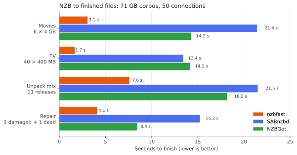
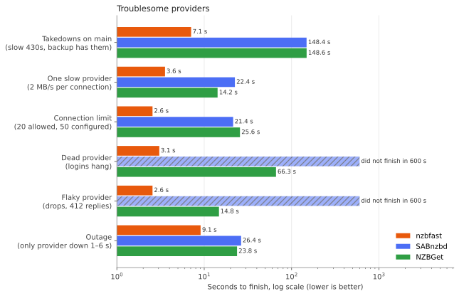

# nzbfast

A Usenet downloader built to run at the speed of the network: tens of gigabits per
second on one box, finished and unpacked files moments after the last article arrives.
It speaks the SABnzbd API, so Sonarr, Radarr and Prowlarr use it as their SABnzbd
download client with no other changes. One binary, no external tools.



| From adding the NZBs to finished files (median of 3 runs) | nzbfast | SABnzbd 5.1 | NZBGet 26.3 |
| --- | --- | --- | --- |
| 6 × 4 GB movies | **3.1 s** | 21.4 s | 14.2 s |
| 40 × 400 MB TV episodes | **1.7 s** | 13.4 s | 14.1 s |
| The same episodes, half of them taken down on the main provider | **7.1 s** | 148.4 s | 148.6 s |
| The movies from a provider 100 ms away | **12.8 s** | 102.6 s | 103.6 s |



Full results, more graphs and the methodology: [docs/BENCHMARKS.md](docs/BENCHMARKS.md).

## Features

**Speed**
- Pipelined NNTP over TLS, one thread per connection, SIMD yEnc decoding (AVX-512,
  SSSE3) and CRC checks on the hot path.
- Stored RAR sets are written straight into the extracted file while downloading: no
  volumes on disk and no unpack step. RAR CRCs are verified from the per-article CRCs.
- Up to 256 jobs download and post-process side by side.

**Post-processing built in**
- par2 verification and Reed–Solomon repair (AVX2), fetching only the recovery volumes
  a repair needs.
- Compressed, encrypted and multi-volume RAR (UnRAR library, linked in), 7z (single or
  split, optionally encrypted) and ZIP, including archives nested inside archives.
- Obfuscated posts come out with real names (from par2 or the MKV title); split files
  (`.mkv.001`…) are joined; files without an extension get one from their content.
- Archive passwords from `<meta type="password">` in the NZB or a `Name{{password}}` job name.

**Made for real providers**
- Learns per job which providers lack its articles (takedowns, retention) and stops
  asking them, so slow "not found" replies don't hold up everything else.
- Sizes each connection's pipeline to the throughput it delivers: a slow provider
  takes only what it can serve and never holds back the end of a job.
- Providers that are down, hang at login or refuse connections are routed around and
  probed every second, so downloading resumes as soon as they're back. Connections
  that drop mid-transfer reconnect immediately; a provider at its connection limit
  keeps working with the connections it allows.
- Dead releases fail within seconds: a `STAT` sample across the whole post shows when
  the missing data exceeds the par2 recovery, so Sonarr/Radarr can grab another release.

**Built for a media server**
- Jobs are assembled in a fast staging area (RAM or NVMe) and moved to the library
  (NAS, NFS, HDD) by a background mover. A staging budget makes slow storage throttle
  downloading instead of filling RAM; a job larger than the budget starts in the space
  there is.
- SABnzbd-compatible API for Sonarr, Radarr and Prowlarr. A running SABnzbd's queue and
  history can be taken over with the same job ids, so nothing is lost when switching.
- Web UI with live throughput per provider, provider health, jobs, queue and history.

## Requirements

- Linux. On x86-64 the SIMD paths are picked at run time; other CPUs use portable code.
- To build: Rust 1.89 or newer and a C++ compiler (for the bundled UnRAR library).
- RAM for staging if you stage in `/dev/shm`; or a fast SSD.

## Install

```sh
cargo build --release
sudo install -m 755 target/release/nzbfast /usr/local/bin/
sudo useradd --system --home /var/lib/nzbfast nzbfast   # or run as your media user
sudo install -d -o nzbfast /var/lib/nzbfast /etc/nzbfast
sudo cp deploy/nzbfast.example.toml /etc/nzbfast/nzbfast.toml   # then edit it
sudo cp deploy/nzbfast.service /etc/systemd/system/
sudo systemctl enable --now nzbfast
```

Run the service as the user that owns your download folders (the one Sonarr and Radarr
run as). The configuration file is documented inline:
[deploy/nzbfast.example.toml](deploy/nzbfast.example.toml).

## Sonarr, Radarr and Prowlarr

Add a **SABnzbd** download client with the host and port from `listen`, the API key, and
a category (`tv`, `movies`). On first start without `api_key` in the config, nzbfast
generates one and stores it in `state_dir/api_key`.

If Sonarr runs in a container that sees the download folder under another path, add a
`[[path_map]]` so the paths nzbfast reports match what Sonarr sees.

### Switching from SABnzbd

Set `sab_ini` to your `sabnzbd.ini` to import servers, categories, API keys and the
completed folder; Sonarr and Radarr then only need the new host and port. To keep the
downloads already in SABnzbd's queue, pause SABnzbd, stop nzbfast and run:

```sh
nzbfast import-sab --sab-url http://127.0.0.1:8080 --sab-incomplete /path/to/incomplete
```

The queue (with SABnzbd's job ids, order, priorities and passwords) and the history
move over, so Sonarr and Radarr keep tracking everything.

## Web UI

`http://host:port/` shows throughput per provider, provider health, active jobs, queue
and history, updated 10 times per second. Sign in with the API key (or open
`/?apikey=KEY` once). Drop NZB files on the page to add them; jobs can be paused,
reprioritised, moved, retried and deleted.

## One-shot downloads

```sh
nzbfast get --out ~/downloads release.nzb                       # servers from /etc/nzbfast/nzbfast.toml
nzbfast get --server host=news.example.com,port=563,tls=1,user=U,pass=P,conns=50 *.nzb
```

## SABnzbd API coverage

`version`, `auth`, `get_config`, `fullstatus`, `status`, `server_stats`, `queue` (list,
`delete`, `pause`, `resume`, `priority`, `rename`, `purge`), `history` (list with
`category`/`search`/`failed_only`/`nzo_ids`, `delete` with `del_files`), `addfile`,
`addurl`, `addlocalfile`, `pause`, `resume`, `switch`, `change_cat`, `retry`,
`get_cats`, `get_scripts`, `warnings`, `get_files`, `config&name=speedlimit`.
Tested with Sonarr 4 and Radarr 6: client test, grab, download, import, failed-download
blocklisting and removal after import.
