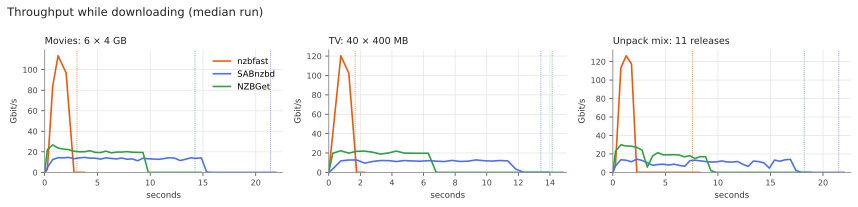
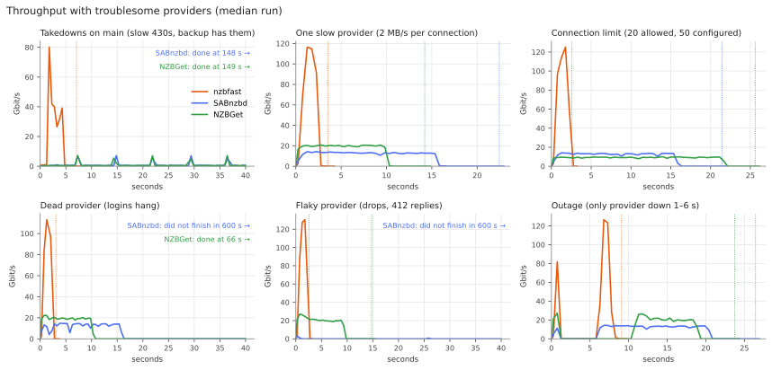
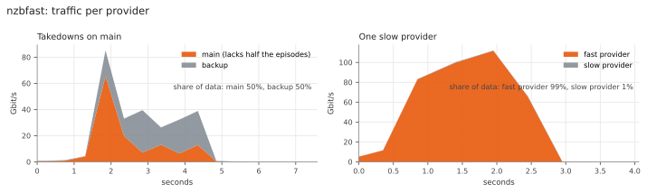
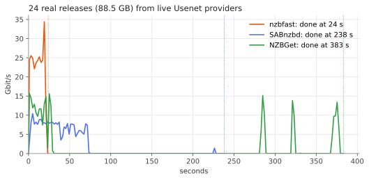
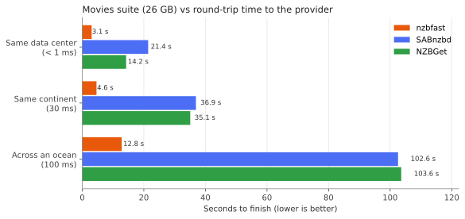
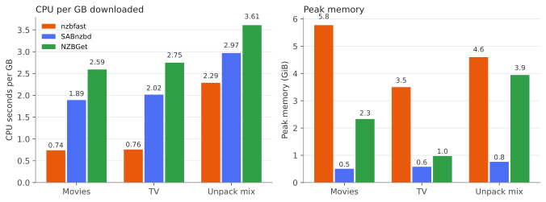

# Benchmarks: nzbfast vs SABnzbd vs NZBGet

nzbfast was compared with SABnzbd 5.1.3 and NZBGet 26.3 on the same machine, downloading
the same releases from the same NNTP server, with every output file checked against a
reference MD5. Besides plain throughput, the suite covers the provider trouble that real
setups run into: takedowns, slow providers, connection limits, dead and flaky servers,
and outages. The harness, the test server and the scripts that drew these graphs are in
[`bench/`](../bench/README.md).

## Summary

| Scenario | nzbfast | SABnzbd | NZBGet | nzbfast vs next best |
| --- | --- | --- | --- | --- |
| 6 × 4 GB movies, NZB to finished file | **3.1 s** | 21.4 s | 14.2 s | 4.6× faster |
| 40 × 400 MB TV episodes | **1.7 s** | 13.4 s | 14.1 s | 7.9× faster |
| Unpack mix: compressed RAR, 7z, obfuscated, encrypted | **7.6 s** | 21.5 s | 18.2 s | 2.4× faster |
| Repair: 3 damaged releases + 1 dead | **4.1 s** | 15.2 s | 8.4 s | 2.0× faster |
| Main provider lacks half the episodes (backup has them) | **7.1 s** | 148.4 s | 148.6 s | 21× faster |
| One of two providers is slow | **3.6 s** | 22.4 s | 14.2 s | 3.9× faster |
| Provider allows fewer connections than configured | **2.6 s** | 21.4 s | 25.6 s | 8.2× faster |
| One of two providers hangs at login | **3.1 s** | did not finish | 66.3 s | 21× faster |
| Provider drops connections and answers 412 for some articles | **2.6 s** | did not finish | 14.8 s | 5.7× faster |
| Only provider goes down for 5 s | **9.1 s** | 26.4 s | 23.8 s | 2.6× faster |
| Provider 100 ms away | **12.8 s** | 102.6 s | 103.6 s | 8.0× faster |
| 24 real releases from live providers (88.5 GB) | **24.0 s** | 238.1 s | 383.1 s | 9.9× faster |
| Dead releases reported to Sonarr/Radarr (live providers) | **10.3 s** | 238.1 s | 370.0 s | 23× sooner |
| 4 vCPUs instead of 10 (movies) | **4.2 s** | 22.5 s | 19.1 s | 4.6× faster |
| CPU time per GB (movies) | **0.74 s** | 1.89 s | 2.59 s | 61% less |
| Peak memory while downloading (movies) | 5.8 GiB | **0.5 GiB** | 2.3 GiB | SABnzbd leanest |

All three clients produced byte-exact output for every release they finished. Times are
the median of three runs, from adding the NZBs until every job sits in the client's
history as completed or failed, so post-processing counts. The harness polls every
0.5 s, which limits the resolution of the shortest times.

## How we tested

| Item | Setting |
| --- | --- |
| Host | AMD EPYC 9375F VM, 16 vCPU, 377 GB RAM, Ubuntu 24.04, Linux 6.8 |
| CPU split | Client pinned to 10 vCPUs; NNTP server pinned to the other 6 |
| Storage | Incomplete and complete folders on tmpfs for every client |
| Server | `nntp-mock`: pre-encoded yEnc articles (716,800-byte parts) served from RAM over TLS, with pipelining |
| Connections | 50 per client (scenarios: as listed below) |
| nzbfast | 0.1.0, default settings |
| SABnzbd | 5.1.3 from source, Python 3.12, sabctools 9.6.3 (AVX-512 yEnc), par2cmdline-turbo 1.5.0, unrar 7.00, 7-Zip; default settings |
| NZBGet | 26.3 (nzbgetcom), official build with bundled unrar 7 and 7za; `PostStrategy=rocket`, 4 GB article cache, 2 GB par buffer |

**Corpus.** 71 GB of unique pseudo-random payloads (incompressible, like video), packaged
the way release groups post them. Every release carries 8% par2 recovery data.

| Suite | Releases | Size | What it exercises |
| --- | --- | --- | --- |
| Movies | 6 × 4 GB, stored RAR5 in 100 MB volumes | 26.0 GB | Raw throughput on large jobs |
| TV | 40 × 400 MB, stored RAR5 in 50 MB volumes | 17.4 GB | Per-job overhead, many jobs at once |
| Unpack mix | 4 plain MKV, 2 compressed RAR (-m3), 2 split 7z, 2 fully obfuscated, 1 header-encrypted | 23.8 GB | Unpacking, deobfuscation, passwords |
| Repair | 3 releases missing 2–5% of their articles, 1 missing 25% (unrepairable) | 8.7 GB | par2 repair, failing fast |

**Variants.** SABnzbd and NZBGet were each run with their defaults and tuned (SABnzbd:
direct unpack, 4 GB article cache, 4 receive threads; NZBGet: the settings above), and
each is reported in its faster variant: SABnzbd's tuned variant was 4–24% slower than
its defaults here, while tuning cut NZBGet's times by 54–81%.

**Metrics.** Each run starts a fresh client with empty state and adds every NZB of the
suite through the client's own API. CPU and memory cover the whole process tree
(including unrar, par2 and 7z), sampled every 0.5 s. Run-to-run spread was under 5%,
except SABnzbd on the TV and unpack suites (up to 14%).

## Throughput

The lines show download rate; the dotted lines mark when each client was done, so the
gap between the two is post-processing.

- **Faster wire.** nzbfast peaks at 114–126 Gbit/s with 50 connections, against 13–15
  Gbit/s for SABnzbd and 22–30 Gbit/s for NZBGet.
- **No unpack step for stored RARs.** nzbfast writes the payload straight into the final
  file while downloading, so a job is done a fraction of a second after its last article.
  NZBGet, even tuned, spends 5 s (movies) to 8 s (TV) unpacking after its download has
  finished.
- **Jobs run side by side.** SABnzbd downloads one job at a time in queue order; NZBGet
  unpacks up to six at a time with `PostStrategy=rocket`. nzbfast downloads and
  post-processes up to 256 jobs at once.

## Troublesome providers

Real providers lose articles to takedowns, slow down, cap connections, hang and drop
connections. Each scenario below gives the clients one or two providers that misbehave
in one specific way. Except in the outage, the healthy capacity alone is enough to
download at full speed.

| Scenario | Providers (connections) | nzbfast | SABnzbd | NZBGet |
| --- | --- | --- | --- | --- |
| **Takedowns.** Half of the 40 TV episodes are gone from the main provider, which takes 500 ms to answer "430 no such article". The backup has everything. | main (40), backup (20) | **7.1 s** | 148.4 s | 148.6 s |
| **Slow provider.** One provider delivers 2 MB/s per connection. Movies. | fast (25), slow (25), same priority | **3.6 s** | 22.4 s | 14.2 s |
| **Connection limit.** The account allows 20 connections; the client is set to 50 and the rest get "502 too many connections". Movies. | main (50) | **2.6 s** | 21.4 s | 25.6 s |
| **Dead provider.** One provider accepts connections but never completes the login. Movies. | good (25), dead (25), same priority | **3.1 s** | did not finish in 600 s (2 of 3 runs) | 66.3 s |
| **Flaky provider.** The main provider drops the connection mid-article every 50 articles and answers 412 for 2.5% of articles. The backup has everything. Movies. | main (40), backup (20) | **2.6 s** | did not finish in 600 s | 14.8 s |
| **Outage.** The only provider refuses and drops every connection from 1 s to 6 s. Movies. | main (50) | **9.1 s** | 26.4 s | 23.8 s |

What nzbfast does differently:

- **It learns which provider lacks a job.** Once a provider has missed half of what it
  was asked for one job, that job's articles go straight to the next provider, with an
  ever sparser probe in case the provider has later files after all. Other jobs keep
  using the provider at full speed. SABnzbd and NZBGet ask the main provider for every
  article of the taken-down episodes and wait half a second for each "not found".
- **It sizes each connection's pipeline to that connection's throughput.** A connection
  keeps about one second's worth of articles requested, so the slow provider here got 1%
  of the data and never held up the end of a job.
- **A provider at its connection limit is not a dead provider.** Connections that are
  refused retry with backoff while the 20 allowed ones carry the download. NZBGet took
  25.6 s here and used 213 CPU-seconds, three times its usual amount.
- **Logins have a deadline.** Articles are only handed to a connection once it has
  logged in, so a server that hangs never sits on work. SABnzbd waited for the dead
  server in 2 of 3 runs (one finished after 183 s); NZBGet needed 66 s.
- **Odd replies are "not found here".** A 412 or 501 for an article sends it to the next
  provider. SABnzbd 5.1.3 retried each article answered with 412 on the same server
  indefinitely (hundreds of times each) and never used the backup.
- **Recovery is quick.** While a provider is down, nzbfast probes it once a second and
  resumes within half a second of it coming back. Connections that drop mid-transfer
  reconnect immediately.

## Post-processing

All three clients produced byte-exact output for all 11 releases of the unpack suite.
The suite queued all of them at once; the table shows when the last release of each
type was complete.

| Release type | nzbfast | SABnzbd | NZBGet |
| --- | --- | --- | --- |
| Plain MKV + par2 (4 × 2 GB) | **2.1 s** | 6.7 s | 5.5 s |
| Compressed RAR5, -m3 (2 × 2 GB) | **7.6 s** | 16.0 s | 13.5 s |
| Split 7z, `.7z.001`… (2 × 2 GB) | **3.1 s** | 21.5 s | 10.2 s |
| Obfuscated: every file name random (2 × 2 GB) | **2.6 s** | 19.5 s | 13.0 s |
| Header-encrypted RAR, password in NZB (1 × 2 GB) | **4.1 s** | 20.5 s | 18.2 s |

nzbfast does all of this in-process: UnRAR linked in, a pure-Rust 7z decoder, its own
par2 and Reed–Solomon. SABnzbd runs unrar, 7z and par2 as external programs; NZBGet
bundles unrar and 7za and has par2 built in.

## Repair and dead releases

| Scenario | nzbfast | SABnzbd | NZBGet |
| --- | --- | --- | --- |
| One release missing 5% (a whole RAR volume): time to repaired file | **2.5 s** | 4.6 s | 6.1 s |
| … CPU time | 10.5 s | 9.3 s | 9.8 s |
| One dead release (25% missing, 8% par2): time to failed | **0.5 s** | 0.6 s | 0.6 s |
| … data downloaded before giving up | **0.07 GB** | 0.18 GB | 0.54 GB |
| Repair suite (3 damaged + 1 dead, queued together): all done | **4.1 s** | 15.2 s | 8.4 s |
| … dead release reported failed after | **1.0 s** | 15.2 s | 3.4 s |

- **Repair costs about the same CPU as par2cmdline-turbo.** Reed–Solomon runs with AVX2
  table lookups in cache-sized tiles, only over the damaged slices.
- **Dead posts are caught from a sample.** Before downloading, nzbfast checks every 25th
  article of every file with `STAT` (no data transferred) and gives up only if the
  projected loss exceeds twice the par2 recovery. Sonarr and Radarr can then grab another
  release right away. None of the repairable releases was given up on.

## Real Usenet providers

24 recent movie and TV grabs from a real Sonarr/Radarr install (0.8–6.6 GB each, 88.5 GB
in all), downloaded from three commercial providers (130 connections) with a fourth as
backup (20 connections), over TLS from a data center in Amsterdam. Three rounds, with
the order of the clients rotated each round.

SABnzbd and NZBGet have downloaded everything that can be downloaded after 30–75 s; most
of the rest of their time goes to retrying the articles of the dead releases.

| Median of 3 rounds | nzbfast | SABnzbd | NZBGet |
| --- | --- | --- | --- |
| All 24 jobs completed or failed | **24.0 s** | 238.1 s | 383.1 s |
| End-to-end rate | **29.5 Gbit/s** | 3.0 Gbit/s | 1.8 Gbit/s |
| Repairable releases completed, each round (of 18) | **18, 18, 18** | 17, 17, 17 | 17, 17, 17 |
| 5 dead releases all reported failed after | **10.3 s** | 238.1 s | 370.0 s |
| Encrypted release without a password | failed at 21 s | paused, never finishes | failed at 27 s |
| CPU time | 178 s | 181 s | 397 s |
| Peak memory | 8.3 GiB | 1.2 GiB | 3.7 GiB |

- The 17 releases that all three clients completed have byte-identical output sizes.
- *Soul.Plane* needs par2 repair: nzbfast completed it every round, while SABnzbd and
  NZBGet failed it every round for lack of recovery blocks.
- Five releases are missing too much data to repair. nzbfast reports them failed within
  seconds, so Sonarr and Radarr can grab another release; SABnzbd and NZBGet download
  for minutes first.
- SABnzbd pauses encrypted releases that come without a password (`pause_on_pwrar`), so
  the job never reaches the history and Sonarr/Radarr keep waiting on it.

## Distance and small machines

Round-trip time was added with `tc netem` on loopback. With 50 connections, SABnzbd and
NZBGet settle at about 2 Gbit/s across an ocean; nzbfast keeps up to eight requests in
flight per connection and holds 16 Gbit/s.

| Movies suite, seconds | nzbfast | SABnzbd | NZBGet |
| --- | --- | --- | --- |
| 10 vCPUs | **3.1** | 21.4 | 14.2 |
| 4 vCPUs | **4.2** | 22.5 | 19.1 |
| TV suite, 4 vCPUs | **2.7** | 14.7 | 15.5 |

## Resources

| Measure | nzbfast | SABnzbd | NZBGet |
| --- | --- | --- | --- |
| CPU seconds per GB: movies / TV / unpack mix | **0.74 / 0.76 / 2.29** | 1.89 / 2.02 / 2.97 | 2.59 / 2.75 / 3.61 |
| Peak memory while downloading | 3.5–5.8 GiB | **0.5–0.8 GiB** | 1.0–3.9 GiB |
| Memory at idle | **7.6 MB** | 75 MB | 8.1 MB |
| Start to API ready | **0.05 s** | 0.40 s | 0.05 s |
| Install | **one 6.2 MB binary** | Python app + unrar, 7z, par2 | 22 MB incl. unrar, 7za |

nzbfast trades memory for speed: up to `write_buffer_mb` of finished chunks wait for the
disk (default 1/16 of RAM, at most 4 GiB), and output being assembled takes about one
8 MB chunk per article in flight. Set `write_buffer_mb` lower on small machines.

## API responsiveness

Measured while the clients were downloading at full speed.

| Client | Add NZB, p50 / p99 | Queue poll, p50 / p99 | History poll, p50 / p99 |
| --- | --- | --- | --- |
| nzbfast | **1.8 / 17 ms** | 0.9 / 5.1 ms | 0.7 / 3.8 ms |
| SABnzbd | 22 / 64 ms | 1.9 / 6.2 ms | 2.6 / 6.9 ms |
| NZBGet | 103 / 106 ms | 0.8 / 19 ms | 0.6 / 5.6 ms |

## Caveats

- **Memory.** nzbfast holds several GiB at full speed; NZBGet or SABnzbd remain the
  choice for a Raspberry Pi-class machine.
- **Integrity checks.** nzbfast trusts the yEnc and RAR CRCs and runs par2 only when data
  is missing, as NZBGet does by default; SABnzbd also checks every job against its par2.
- **Test server.** The controlled suites use nzbfast's own test server (standard
  `AUTHINFO`/`BODY`/`STAT` over TLS with pipelining); SABnzbd and NZBGet ran against it
  unmodified. Its provider behaviours are simplified models of what real providers do.
- **Storage.** Every client wrote to tmpfs; disk-bound setups (HDD, NFS) were not
  measured.
- **Queue order.** SABnzbd downloads strictly one job at a time from the top of the
  queue, which some users prefer.
